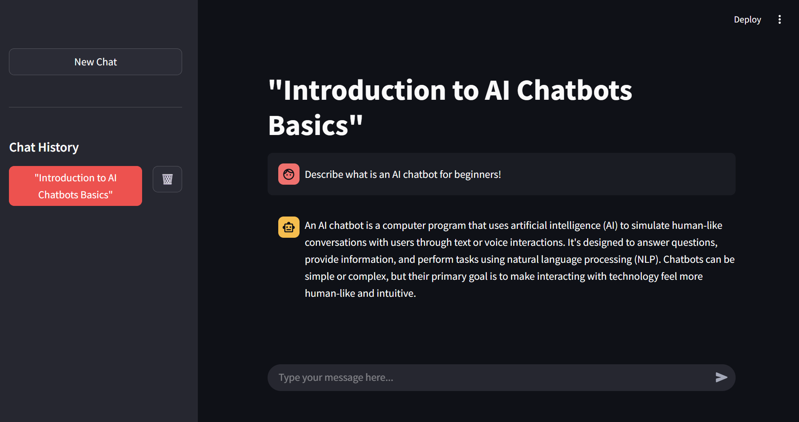

# Chat Session with Ollama

A Streamlit-based chatbot app that leverages the Ollama Llama 3.2 model and stores chat history in PostgreSQL. The app is containerized using Docker and orchestrated with Docker Compose.

---

## Features

- **Chat with Llama 3.2**: Interact with an offline Llama 3.2 model using a web UI made with Streamlit.
- **Session Management**: Start new chat sessions, view chat history, and delete sessions.
- **AI-powered Session Title**: Automatically generate a title for each chat session using the Ollama model.
- **Persistent Storage**: All chat history is stored in a PostgreSQL database.
- **Easy Setup**: One-command startup with Docker Compose.

---

## Getting Started

### Prerequisites

- [Docker](https://www.docker.com/get-started)
- [Docker Compose](https://docs.docker.com/compose/)

---

### Installation & Running

1. **Clone the repository:**
   ```bash
   git clone https://github.com/jddiosana/chat-session-with-ollama.git
   cd chat-session-with-ollama
   ```

2. **Start the application:**
   ```bash
   docker-compose up --build
   ```

   This will build and start three services:
   - `app`: The Streamlit chatbot frontend and backend.
   - `db`: PostgreSQL database for chat history.
   - `ollama`: Ollama server for running the Llama 3.2 model.

---

### What to Expect

- After building the containers, you will see logs similar to:

  ```
  ⬇️ Pulling llama3.2... This may take a few minutes ⏳
  ...
  pulling manifest
  ```

#### ⚠️ **IMPORTANT!**

- **The app will be accessible at [localhost:8501](http://localhost:8501)**, but it will not be functional until the Ollama model is fully pulled and ready.

- Wait for the following log message before using the app:

  ```
  ✅ Model llama3.2 is ready to use! Try running the app now: localhost:8501
  ```

- If you entered a query before seeing the above log message, you will encounter the following error:
  ```
  ERROR: ollama._types.ResponseError: model "llama3.2" not found, try pulling it first
  ```
  This is because the model pull is not yet complete. You must wait for the log message above to appear before using the app.

### How to Use the App

1. **Start a New Chat Session**:
   - Click the "New Chat" button to start a new chat session.
   - Enter your message in the input field and click "Send" to send your message to the model.
   - The model will respond to your message and the chat history will be updated.
   
   

2. **View Chat History**:
    - Click a chat session to view the chat history.
    - The chat history will be displayed in the chat area.

    
    
---

## Project Structure

```
chat-session-with-ollama/
├── app/
│   ├── main.py           # Streamlit app entry point
│   ├── core/             # Core logic (chains, prompts)
│   ├── db/               # Database connection
│   ├── services/         # Chat and session services
│   └── tests/            # Unit tests
├── Dockerfile            # App container
├── Dockerfile.ollama     # Ollama model container
├── docker-compose.yml    # Multi-container orchestration
├── entrypoint.sh         # Ollama model setup script
├── requirements.txt      # Python dependencies
└── README.md
```

---

## Configuration

- Environment variables for the database are set in `docker-compose.yml` and `Dockerfile`.
- The Ollama container will automatically pull the `llama3.2` model on first run.

---

## Development

- To run tests:
  ```bash
  docker-compose exec app pytest
  ```

### Running the App Locally

To run the app locally (without Docker), follow these steps:

#### 1. Prerequisites
- **Python 3.10+**: Make sure you have Python 3.10 or higher installed. You can check your version with:
  ```bash
  python --version
  ```
- **Ollama**: Install Ollama and ensure it is running locally. Follow the instructions at [https://ollama.com](https://ollama.com/).
- **PostgreSQL**: You need a running PostgreSQL instance. You can run it via Docker or install it natively.

#### 2. Set Up PostgreSQL (using Docker)
If you don't have PostgreSQL installed, you can quickly start one with Docker:
```bash
docker run --name local-postgres -e POSTGRES_DB=chat-history -e POSTGRES_USER=postgres -e POSTGRES_PASSWORD=password -p 5432:5432 -d postgres:latest
```

#### 3. Clone the Repository
```bash
git clone https://github.com/jddiosana/chat-session-with-ollama.git
cd chat-session-with-ollama
```

#### 4. Install Python Dependencies
```bash
pip install -r requirements.txt
```

#### 5. Configure Environment Variables
- Copy the example environment file and edit as needed:
  ```bash
  cp .env.example .env
  ```
- Set the following variables in your `.env` file (example values shown):
  ```env
  OLLAMA_MODEL="llama3.2"           # The Ollama model to use
  OLLAMA_URL="http://localhost:11434"  # Ollama server URL (use http://localhost:11434 for local dev)

  DB_NAME="chat-history"            # PostgreSQL database name
  DB_USER="postgres"                # PostgreSQL user
  DB_PASSWORD="password"            # PostgreSQL password
  DB_HOST="localhost"               # Database host (use 'localhost' for local dev)
  DB_PORT=5432                       # Database port

  CHAT_HISTORY_TABLE="chat_history"     # Table for storing chat history
  SESSION_TITLE_TABLE="session_title"   # Table for storing session titles
  ```

#### 6. Start Ollama and Pull the Model
- Make sure the Ollama server is running:
  ```bash
  ollama serve &
  ```
- Pull the Llama 3.2 model (if not already present):
  ```bash
  ollama pull llama3.2
  ```

#### 7. Run the App
```bash
streamlit run app/main.py
```
- The app will be available at [http://localhost:8501](http://localhost:8501).

#### 8. Run the Tests
```bash
pytest
```

#### Troubleshooting
- **Database Connection Issues**: Ensure PostgreSQL is running and the credentials in your `.env` file match your local setup.
- **Ollama Not Found**: Make sure Ollama is installed and running on your machine.
- **Port Conflicts**: If ports 5432 (Postgres), 11434 (Ollama), or 8501 (Streamlit) are in use, stop the conflicting services or change the ports in your configuration.

---
